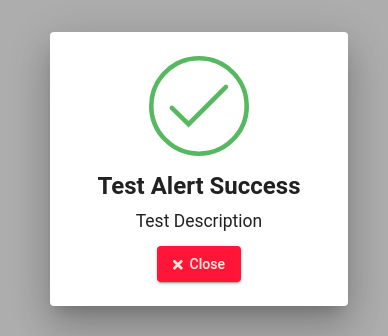

<a href="https://github.com/ivanantunes/angular-modal-material">
    <h1 align="center">Modal Material</h1>
</a>
A service developed based on the angular material. Containing customizable and templete alerts.

<p align="center">
<a href="https://badge.fury.io/for/js/modal-material"></a>
</p>

## Table of contents

1. [Installation and Dependencies](#installation-and-dependencies)
2. [Quick start](#quick-start)
3. [Available Functions](#available-functions)
4. [DEMO](https://ivanantunes.github.io/angular-modal-material/)

## Installation and Dependencies

Use the command below to add the service to your [Angular](https://github.com/angular/angular-cli) application.

```
npm install --save modal-material
```

Immediately after installing the service, import the module into your application.

```javascript
import { ModalMaterialModule } from 'modal-material';

/*---------------------------------------------------*/

@NgModule({
  imports: [
    ModalMaterialModule
  ],
})
```

Once this is done, it is ready to be used, just import the service into one of its components of use.

```javascript
import { Component } from '@angular/core';

// Import Service

import { ModalMaterialService } from 'modal-material';

@Component({
  selector: 'app-test-modal',
  templateUrl: './test-modal.component.html',
  styleUrls: ['./test-modal.component.scss']
})
export class TestModalComponent {

  constructor(private modal: ModalMaterialService) {}

}

```

It is necessary to install the [Font Awesome](https://www.npmjs.com/package/components-font-awesome) library to use 100% of the service.

To install it in your angular application just go to the **angular.json** file in the **styles** section and add the following line.

```json
"styles": [
  "./node_modules/components-font-awesome/css/all.css",
],
```

That done, you are ready to enjoy the service 100%.

## Quick start

```javascript
import { Component } from '@angular/core';

// Import Service

import { ModalMaterialService } from 'modal-material';

@Component({
  selector: 'app-test-modal',
  templateUrl: './test-modal.component.html',
  styleUrls: ['./test-modal.component.scss']
})
export class TestModalComponent implements OnInit {

  constructor(private modal: ModalMaterialService) {}

  ngOnInit() {
    this.modal.mTSuccess(
      'Test Alert Success', // Alert Title
      'Test Description',  // Alert Description
      'Close', // Close Alert Button Title
      'auto',  // Alert Width. Example 100px, 100%.
      'auto', // Alert height. Example 100px, 100%.
      true // When you click outside the modal it will close itself. True case it does not close.
    );
  }
}

```

- Quick start result



## Available Functions

Below are all available functions and possible alerts.

### **mTSuccess**

```javascript
this.modal.mTSuccess(
  "Test Alert Success", // Alert Title
  "Test Description", // Alert Description
  "Close", // Close Alert Button Title
  "auto", // Alert Width. Example 100px, 100%.
  "auto", // Alert height. Example 100px, 100%.
  true // When you click outside the modal it will close itself. True case it does not close.
);
```

### **mTSuccessLog**

```javascript
this.modal.mTSuccessLog(
  "Test Alert Success Log", // Alert Title
  "Test Description Log", // Alert Description
  "Close", // Close Alert Button Title
  "Details", // Details button title.
  "Careful it looks like the system is getting overloaded.", // Log
  "auto", // Alert Width. Example 100px, 100%.
  "auto", // Alert height. Example 100px, 100%.
  true // When you click outside the modal it will close itself. True case it does not close.
);
```

### **mTSuccessConfirm**

```javascript
this.modal
  .mTSuccessConfirm(
    "Test Alert Success", // Alert Title
    "Test Description", // Alert Description
    "Close", // Close Alert Button Title
    "Confirm", // Confirmation Button title.
    "auto", // Alert Width. Example 100px, 100%.
    "auto", // Alert height. Example 100px, 100%.
    true // When you click outside the modal it will close itself. True case it does not close.
  )
  .subscribe((res) => {
    if (res) {
      console.log("Confirmed!");
    } else {
      console.log("Canceled");
    }
  });
```

### **mTAlert**

```javascript
this.modal.mTAlert(
  "Test Alert", // Alert Title
  "Test Description", // Alert Description
  "Close", // Close Alert Button Title
  "auto", // Alert Width. Example 100px, 100%.
  "auto", // Alert height. Example 100px, 100%.
  true
);
```

### **mTAlertLog**

```javascript
this.modal.mTAlertLog(
  "Test Alert Log", // Alert Title
  "Test Description Log", // Alert Description
  "Close", // Close Alert Button Title
  "Details", // Details button title.
  "Congratulations you have just used the alert log service", // Log
  "auto", // Alert Width. Example 100px, 100%.
  "auto", // Alert height. Example 100px, 100%.
  true // When you click outside the modal it will close itself. True case it does not close.
);
```

### **mTAlertConfirm**

```javascript
this.modal
  .mTAlertConfirm(
    "Test Alert", // Alert Title
    "Test Description", // Alert Description
    "Close", // Close Alert Button Title
    "Confirm", // Confirmation Button title.
    "auto", // Alert Width. Example 100px, 100%.
    "auto", // Alert height. Example 100px, 100%.
    true // When you click outside the modal it will close itself. True case it does not close.
  )
  .subscribe((res) => {
    if (res) {
      console.log("Confirmed!");
    } else {
      console.log("Canceled");
    }
  });
```

### **mTError**

```javascript
this.modal.mTError(
  "Test Alert Error", // Alert Title
  "Test Description", // Alert Description
  "Close", // Close Alert Button Title
  "auto", // Alert Width. Example 100px, 100%.
  "auto", // Alert height. Example 100px, 100%.
  true
);
```

### **mTErrorLog**

```javascript
this.modal.mTErrorLog(
  "Test Alert Error Log", // Alert Title
  "Test Description Log", // Alert Description
  "Close", // Close Alert Button Title
  "Details", // Details button title.
  "Error failed to bring user from database.", // Log
  "auto", // Alert Width. Example 100px, 100%.
  "auto", // Alert height. Example 100px, 100%.
  true // When you click outside the modal it will close itself. True case it does not close.
);
```

### **mTErrorConfirm**

```javascript
this.modal
  .mTErrorConfirm(
    "Test Alert Error", // Alert Title
    "Test Description", // Alert Description
    "Close", // Close Alert Button Title
    "Confirm", // Confirmation Button title.
    "auto", // Alert Width. Example 100px, 100%.
    "auto", // Alert height. Example 100px, 100%.
    true // When you click outside the modal it will close itself. True case it does not close.
  )
  .subscribe((res) => {
    if (res) {
      console.log("Confirmed!");
    } else {
      console.log("Canceled");
    }
  });
```

### **mManualBasic**

```javascript
this.modal.mManualBasic(
  "Test Alert", // Alert Title
  "Test Description", // Alert Description
  "Close", // Close Alert Button Title
  "fab fa-npm", // Put the icon class if it is https://fontawesome.com/
  // if not just put the icon name if you are going to use https://material.io/
  "green", // Background color that will be behind the icon when the modal appears.
  false, // If using https://material.io/ leave true if using https://fontawesome.com/ leave false.
  "auto", // Alert Width. Example 100px, 100%.
  "auto", // Alert height. Example 100px, 100%.
  true // When you click outside the modal it will close itself. True case it does not close.
);
```

### **mManualLog**

```javascript
this.modal.mManualLog(
  "Title Alert", // Alert Title
  "Title Description", // Alert Description
  "Close", // Close Alert Button Title
  "Details", // Details button title.
  "person", // Put the icon class if it is https://fontawesome.com/
  // if not just put the icon name if you are going to use https://material.io/
  "red", // Background color that will be behind the icon when the modal appears.
  true, // If using https://material.io/ leave true if using https://fontawesome.com/ leave false.
  "Failed to add person.", // Log
  "auto", // Alert Width. Example 100px, 100%.
  "auto", // Alert height. Example 100px, 100%.
  true // When you click outside the modal it will close itself. True case it does not close.
);
```

### **mManualConfirm**

```javascript
this.modal
  .mManualConfirm(
    "Test Alert", // Alert Title
    "Test Description", // Alert Description
    "Close", // Close Alert Button Title
    "Confirm", // Confirmation Button title.
    "warning", // Put the icon class if it is https://fontawesome.com/
    // if not just put the icon name if you are going to use https://material.io/
    "yellow", // Background color that will be behind the icon when the modal appears.
    true, // If using https://material.io/ leave true if using https://fontawesome.com/ leave false.
    "auto", // Alert Width. Example 100px, 100%.
    "auto", // Alert height. Example 100px, 100%.
    true // When you click outside the modal it will close itself. True case it does not close.
  )
  .subscribe((res) => {
    if (res) {
      console.log("Confirmed!");
    } else {
      console.log("Canceled");
    }
  });
```
