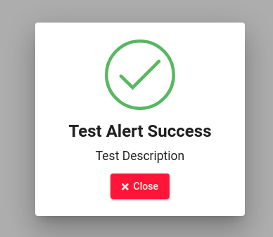

<a href="https://github.com/ivanantunes/angular-modal-material">
    <h1 align="center">Modal Material</h1>
</a>

A Service developed based on [Angular Material]("https://material.angular.io/") using the [Angular CLI]("https://angular.io/") framework. Containing Customized Alerts and Templates pre made with basic settings for display.

<p align="center">
<a href="https://badge.fury.io/for/js/modal-material"></a>
<a href="https://www.npmjs.com/package/modal-material"></a>
<a href="https://www.npmjs.com/package/modal-material"></a>
<a href="https://www.npmjs.com/package/modal-material"></a>
<a href="https://www.npmjs.com/package/modal-material"></a>
<a href="https://www.npmjs.com/package/modal-material"></a>
<a href="https://twitter.com/D4rks001"></a>
</p>
<p align="center">
<a href="https://nodei.co/npm/modal-material/"></a>
</p>


## Table of contents

1. [Installation and Dependencies](#installation-and-dependencies)
2. [Quick start](#quick-start)
3. [Available Functions](#available-functions)
4. [DEMO](https://ivanantunes.github.io/angular-modal-material/)

## Installation and Dependencies

Use the command below to add the service to your [Angular](https://github.com/angular/angular-cli) application.

```
npm install --save modal-material
```

Immediately after installing the service, import the module into your application.

```javascript
import { ModalMaterialModule } from 'modal-material';

/*---------------------------------------------------*/

@NgModule({
  imports: [
    ModalMaterialModule
  ],
})
```

Once this is done, it is ready to be used, just import the service into one of its components of use.

```javascript
import { Component } from '@angular/core';

// Import Service

import { ModalMaterialService } from 'modal-material';

@Component({
  selector: 'app-test-modal',
  templateUrl: './test-modal.component.html',
  styleUrls: ['./test-modal.component.scss']
})
export class TestModalComponent {

  constructor(private modal: ModalMaterialService) {}

}

```

It is necessary to install the [Font Awesome](https://www.npmjs.com/package/components-font-awesome) library to use 100% of the service.

To install it in your angular application just go to the **angular.json** file in the **styles** section and add the following line.

```json
"styles": [
  "./node_modules/components-font-awesome/css/all.css",
],
```

That done, you are ready to enjoy the service 100%.

## Quick start

```javascript
import { Component } from '@angular/core';

// Import Service

import { ModalMaterialService } from 'modal-material';

@Component({
  selector: 'app-test-modal',
  templateUrl: './test-modal.component.html',
  styleUrls: ['./test-modal.component.scss']
})
export class TestModalComponent implements OnInit {

  constructor(private modal: ModalMaterialService) {}

  ngOnInit() {
    this.modal.mTSuccess({
      title: 'Test Alert Success', // Alert Title
      description: 'Test Description',  // Alert Description
      btnCloseTitle: 'Close', // Close Alert Button Title
      width: 'auto',  // Alert Width. Example 100px, 100%.
      height: 'auto', // Alert height. Example 100px, 100%.
      disableClose: true // When you click outside the modal it will close itself. True case it does not close.
    });
  }
}

```

- Quick start result



## Available Functions

Below are all available functions and possible alerts.

### **mTSuccess**

```javascript
this.modal.mTSuccess({
  title: 'Test Alert Success', // Alert Title
  description: 'Test Description',  // Alert Description
  btnCloseTitle: 'Close', // Close Alert Button Title
  width: 'auto',  // Alert Width. Example 100px, 100%.
  height: 'auto', // Alert height. Example 100px, 100%.
  disableClose: true // When you click outside the modal it will close itself. True case it does not close.
});
```

### **mTSuccessLog**

```javascript
this.modal.mTSuccessLog(
  {
   title: 'Test Alert Success Log', // Alert Title
   description: 'Test Description Log', // Alert Description
   btnCloseTitle: 'Close', // Close Alert Button Title
   btnLogTitle: 'Details', // Details button title.
   log: 'Careful it looks like the system is getting overloaded.', // Log
   width: 'auto', // Alert Width. Example 100px, 100%.
   height: 'auto', // Alert height. Example 100px, 100%.
   disableClose: true // When you click outside the modal it will close itself. True case it does not close.
  }
);
```

### **mTSuccessConfirm**

```javascript
this.modal.mTSuccessConfirm(
  {
   title: 'Test Alert Success', // Alert Title
   description: 'Test Description', // Alert Description
   btnCloseTitle: 'Close', // Close Alert Button Title
   btnConfirmTitle: 'Confirm', // Confirmation Button title.
   width: 'auto', // Alert Width. Example 100px, 100%.
   height: 'auto', // Alert height. Example 100px, 100%.
   disableClose: true // When you click outside the modal it will close itself. True case it does not close.
  }
).subscribe((res) => {
  if (res) {
    console.log('Confirmed!');
  } else {
    console.log('Canceled');
  }
});
```

### **mTAlert**

```javascript
this.modal.mTAlert(
  {
    title: 'Test Alert', // Alert Title
    description: 'Test Description',  // Alert Description
    btnCloseTitle: 'Close', // Close Alert Button Title
    width: 'auto',  // Alert Width. Example 100px, 100%.
    height: 'auto', // Alert height. Example 100px, 100%.
    disableClose: true
  }
);
```

### **mTAlertLog**

```javascript
this.modal.mTAlertLog(
  {
    title: 'Test Alert Log', // Alert Title
    description: 'Test Description Log', // Alert Description
    btnCloseTitle: 'Close', // Close Alert Button Title
    btnLogTitle: 'Details', // Details button title.
    log: 'Congratulations you have just used the alert log service', // Log
    width: 'auto', // Alert Width. Example 100px, 100%.
    height: 'auto', // Alert height. Example 100px, 100%.
    disableClose: true // When you click outside the modal it will close itself. True case it does not close.
  }
);
```

### **mTAlertConfirm**

```javascript
this.modal.mTAlertConfirm(
  {
    title: 'Test Alert', // Alert Title
    description: 'Test Description', // Alert Description
    btnCloseTitle: 'Close', // Close Alert Button Title
    btnConfirmTitle: 'Confirm', // Confirmation Button title.
    width: 'auto', // Alert Width. Example 100px, 100%.
    height: 'auto', // Alert height. Example 100px, 100%.
    disableClose: true // When you click outside the modal it will close itself. True case it does not close.
  }
).subscribe((res) => {
  if (res) {
    console.log('Confirmed!');
  } else {
    console.log('Canceled');
  }
});
```

### **mTError**

```javascript
this.modal.mTError(
  {
    title: 'Test Alert Error', // Alert Title
    description: 'Test Description',  // Alert Description
    btnCloseTitle: 'Close', // Close Alert Button Title
    width: 'auto',  // Alert Width. Example 100px, 100%.
    height: 'auto', // Alert height. Example 100px, 100%.
    disableClose: true
  }
);
```

### **mTErrorLog**

```javascript
this.modal.mTErrorLog(
  {
    title: 'Test Alert Error Log', // Alert Title
    description: 'Test Description Log', // Alert Description
    btnCloseTitle: 'Close', // Close Alert Button Title
    btnLogTitle: 'Details', // Details button title.
    log: 'Error failed to bring user from database.', // Log
    width: 'auto', // Alert Width. Example 100px, 100%.
    height: 'auto', // Alert height. Example 100px, 100%.
    disableClose: true // When you click outside the modal it will close itself. True case it does not close.
  }
);
```

### **mTErrorConfirm**

```javascript
this.modal.mTErrorConfirm(
  {
    title: 'Test Alert Error', // Alert Title
    description: 'Test Description', // Alert Description
    btnCloseTitle: 'Close', // Close Alert Button Title
    btnConfirmTitle: 'Confirm', // Confirmation Button title.
    width: 'auto', // Alert Width. Example 100px, 100%.
    height: 'auto', // Alert height. Example 100px, 100%.
    disableClose: true // When you click outside the modal it will close itself. True case it does not close.
  }
).subscribe((res) => {
  if (res) {
    console.log('Confirmed!');
  } else {
    console.log('Canceled');
  }
});
```

### **mManualBasic**

```javascript
this.modal.mManualBasic(
  {
    title: 'Test Alert', // Alert Title
    description: 'Test Description',  // Alert Description
    btnCloseTitle: 'Close', // Close Alert Button Title
    icon: 'fab fa-npm', // Put the icon class if it is https://fontawesome.com/
    // if not just put the icon name if you are going to use https://material.io/
    mBackgroundColorIcon: 'green', // Background color that will be behind the icon when the modal appears.
    useMatIcon: false, // If using https://material.io/ leave true if using https://fontawesome.com/ leave false.
    width: 'auto', // Alert Width. Example 100px, 100%.
    height: 'auto', // Alert height. Example 100px, 100%.
    disableClose: true // When you click outside the modal it will close itself. True case it does not close.
  }
);
```

### **mManualLog**

```javascript
this.modal.mManualLog(
  {
    modalMB: {
     title: 'Title Alert', // Alert Title
     description: 'Title Description', // Alert Description
     btnCloseTitle: 'Close', // Close Alert Button Title
     icon: 'person', // Put the icon class if it is https://fontawesome.com/
      // if not just put the icon name if you are going to use https://material.io/
     mBackgroundColorIcon: 'red', // Background color that will be behind the icon when the modal appears.
     useMatIcon: true,  // If using https://material.io/ leave true if using https://fontawesome.com/ leave false.
     width: 'auto',  // Alert Width. Example 100px, 100%.
     height: 'auto', // Alert height. Example 100px, 100%.
     disableClose: true // When you click outside the modal it will close itself. True case it does not close.
    },
    btnLogTitle: 'Details', // Details button title.
    log: 'Failed to add person.', // Log
  }
);
```

### **mManualConfirm**

```javascript
this.modal.mManualConfirm(
  {
    modalMB: {
      title: 'Test Alert', // Alert Title
      description: 'Test Description', // Alert Description
      btnCloseTitle: 'Close', // Close Alert Button Title
      icon: 'warning', // Put the icon class if it is https://fontawesome.com/
      // if not just put the icon name if you are going to use https://material.io/
      mBackgroundColorIcon: 'yellow', // Background color that will be behind the icon when the modal appears.
      useMatIcon: true,  // If using https://material.io/ leave true if using https://fontawesome.com/ leave false.
      width: 'auto',  // Alert Width. Example 100px, 100%.
      height: 'auto', // Alert height. Example 100px, 100%.
      disableClose: true // When you click outside the modal it will close itself. True case it does not close.
    },
    btnConfirmTitle: 'Confirm', // Confirmation Button title.
  }
).subscribe((res) => {
  if (res) {
    console.log('Confirmed!');
  } else {
    console.log('Canceled');
  }
});
```
